	 _                      ______
	| |                    |  ____|
	| |     __ ___   ____ _| |__ _ __ __ _ _ __ ___   ___
	| |    / _` \ \ / / _` |  __| '__/ _` | '_ ` _ \ / _ \
	| |___| (_| |\ V / (_| | |  | | | (_| | | | | | |  __/
	|______\__,_| \_/ \__,_|_|  |_|  \__,_|_| |_| |_|\___|

	     LavaFrame. A meditative stylish light object
	  created 2022 by Thomas Smits and Daniel Springwald

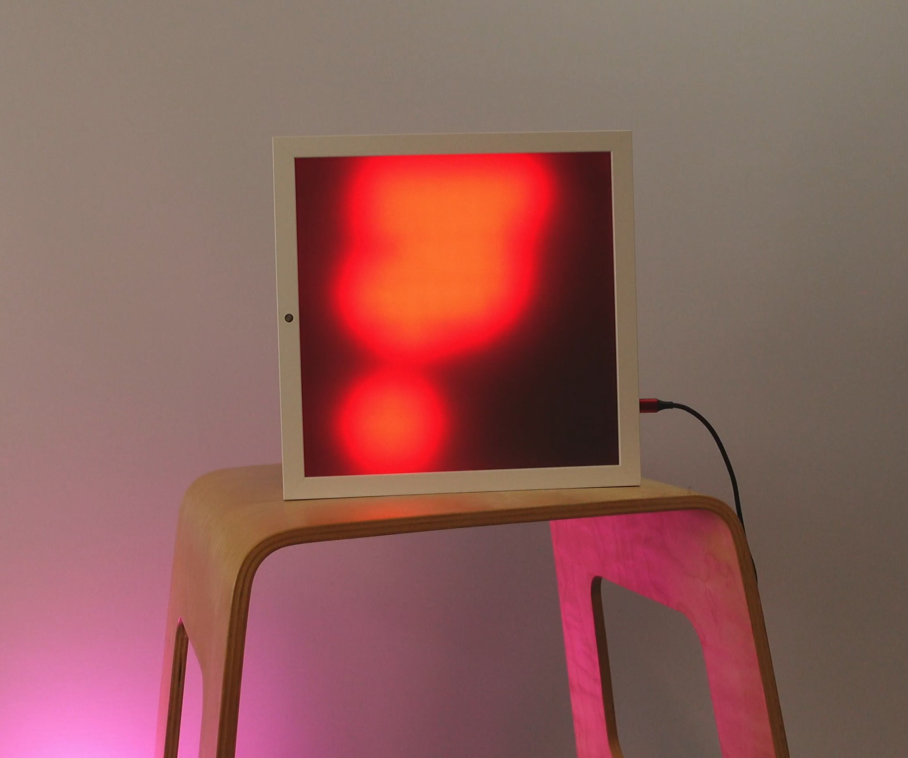

This light object was created in 2022 in a hackathon based on
a white Ikea Sannahed frame 25x25 cm, 169 RGB LED and an ESP32.

  * [License](LICENSE.md)
  * [Sources](src/lavaframe/README.md)

## Button usage

| button | state | description                                            |
| ------ | ----- | ------------------------------------------------------ |
| 1      | press | next animation                                         |
| 1      | hold  | change mode between *slideshow* and *single animation* |
| 2      | press | change rotation                                        |
| 2      | hold  | change brightness                                      |

## Animations already built in

### Lava

### Fire

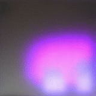
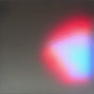
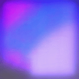

### Color Wheel

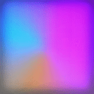
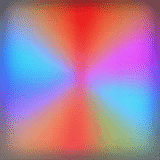
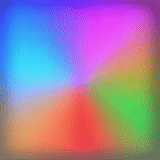

### Bubbles

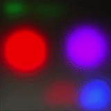
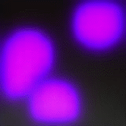

### Plasma

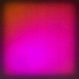

### Circle

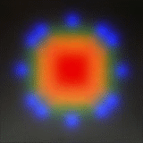

### Startup

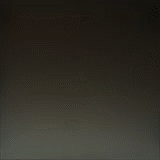

## How to write an animation?

If you want to add your own animation, you have to perform the following steps:

  * Create a subclass of `Animation`.
  * Register the class in the `setup` function of `lavaframe.ino`.

The easiest way is to start from the `TestAnimation` class, defined in `test_animation.ino` and `test_animation.h`.
